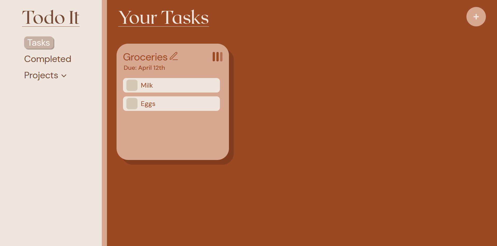

# Todo It ✅

This is a todo list application web application built as part of The Odin Project curriculum. The goal of this project is to practice working with JavaScript modules, Webpack, and local storage.

## Screenshot



# Features ✨

## Add, Edit, and Delete Tasks

Users can easily create tasks by pressing the "+" button in the upper right corner of the application and entering a title, due date, subtasks (optional), a priority level, and a project. Tasks can also be edited or deleted at any time.

## Complete Tasks

Tasks are marked complete when all subtasks are completed. Once completed, tasks will be moved to the "Completed" tab and a toast notification will appear to the right.

## Filtered Views

Users can organize their tasks by grouping them under projects, which can be added in the sidebar of the application.

## Persisted Data with localStorage

Tasks and projects are saved in the browser's local storage, so that users' data stay intact even after refreshing or closing the application.

# Installation

1. Clone the repository to your local machine:
   ```bash
   git clone https://github.com/thyuhtooaung-dev/TODO_LIST.git
   ```
2. Navigate to the project directory:
   ```bash
   cd TODO_LIST
   ```
3. Install the required dependencies:
   ```bash
   npm install
   ```

## Building the Project

To bundle the application using Webpack, run:

```bash
npx webpack
```

This will generate the bundled files in the `dist` folder.

## Running the Application

1. Open the `dist/index.html` file in a web browser.
   - You can do this by double-clicking the `index.html` file in the `dist` folder or by serving it with a local server (e.g., using `npx serve dist` for a simple HTTP server).

## Notes

- Ensure you have a stable internet connection during `npm install` to fetch dependencies.
- If you encounter issues, verify that Webpack is correctly configured in the `webpack.config.js` file.
